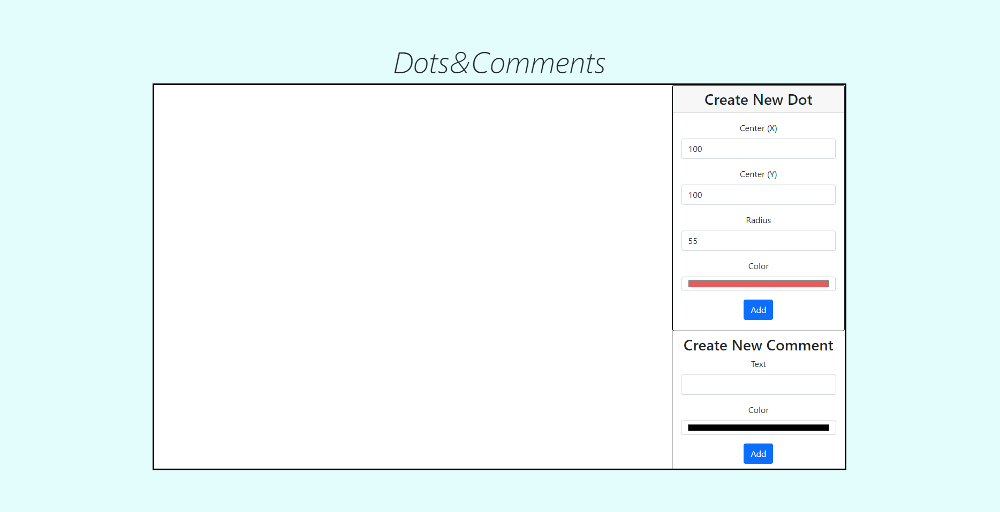
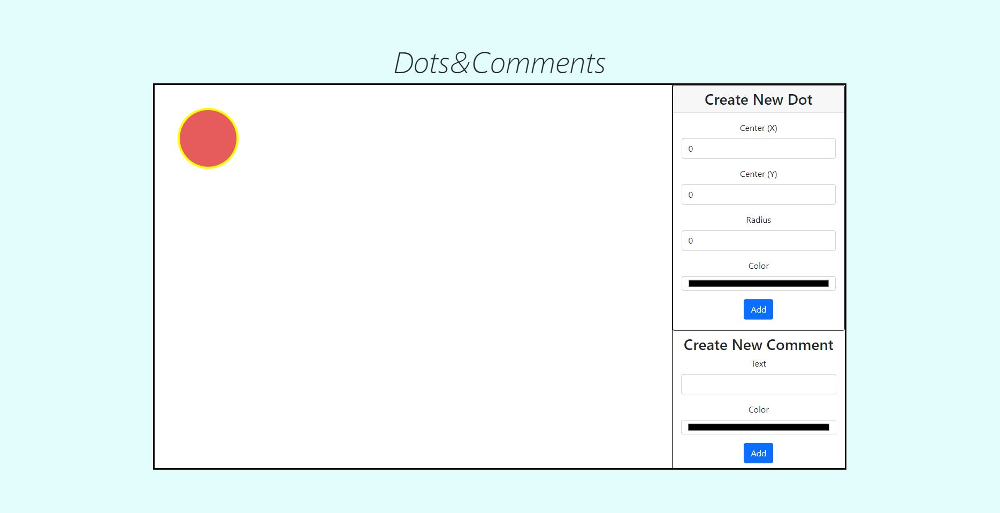

### Особенности реализации:
* Серверная часть и взаимодействие с ней через клиентскую часть были выполнены на основе шаблона "ASP.NET Core Web API"
* В качестве базы данных была использована In-Memory-Database
* Для работы с базой данных использована ORM Entity Framework Core
* Для получения данных на клиентскую часть был использован AJAX
* За отрисовку объектов на клиенте отвечает библиотека Konva.js
* Для верстки клиента был использован Bootstrap
---
### Сущности, выделенные в базе данных:
1. Dot:
    - int Id - id точки
    - float xCenter - координаты центра точки по оси X
    - float yCenter - координаты центра точки по оси Y
    - float Radius - радиус точки
    - string Color - цвет точки
2. Comment:
    - int Id - id комментария 
    - string Text - текст комментария
    - string Color - цвет подложки комментария
    - int DotId - id точки, к которой был написан комментарий

---
### Реализованный функционал сервиса:

[Видео-демонстрация работы сервиса](https://youtu.be/v0LktkhcMCk)

__1. Создание точки:__

Пользователь может создать новую точку с помощью формы "Create New Dot", указав в форме все необходимые параметры (координаты центра, радиус и цвет)

__2. Создание комментария к точке:__

Пользователь может создать новый комментарий к точке. Для этого ему необходимо: 
* Выбрать точку, к которой будет прикреплен комментарий. Выбор точки происходит по нажатию на точку. Выбранная точка подсвечивается желтым контуром.
* Воспользоваться формой "Create New Comment", указав необходимые все параметры (текст комментария и цвет подложки).

__3. Удаление точки:__

Пользователь может удалить точку. Удаление происходит по двойному нажатию по точке. Удаление точки означает удаление точки и ее комментариев из базы данных.

